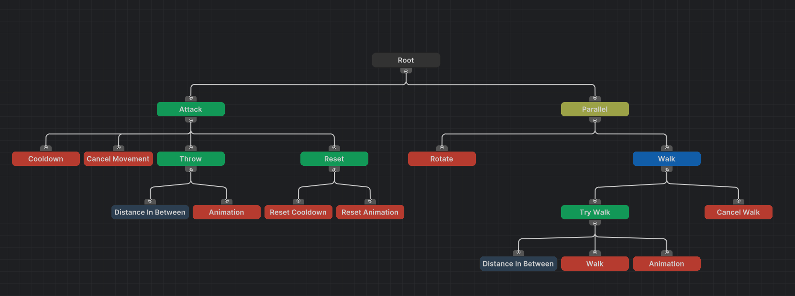

# Tree Flow

**Tree Flow** is a lightweight, modular **Behavior Tree framework** for Unity. 
It provides an intuitive editor and a flexible runtime system to quickly create and manage AI patterns.

If you need a refresher on the theory of the structure, you can read [this](https://en.wikipedia.org/wiki/Behavior_tree_(artificial_intelligence,_robotics_and_control))

> :warning: **Work in Progress**<br>
> This package is still in active development; Some features may be missing and bugs are expected.

---

## Overview
### Installation
To install this package, run the `Add Package From git URL` command from the package manager, and paste the following URL:

```
https://github.com/WarperSan/TreeFlow.git
```

If the command doesn't work, you can always install it directly from the [source](https://github.com/WarperSan/TreeFlow/releases).

---

## Features
- Build AI behavior trees with minimal overhead.
- Design trees visually inside Unity.
- Includes common built-in nodes.
- Flexible framework for custom nodes.



---

## Runtime
This section goes over everything related to the **runtime** side of this package. Anything mentioned here will be present during play time or in a build.

### Nodes
The class `Node` is the smallest unit in a tree. Every node **must** inherit from it, either directly or indirectly. Along with it, you can find `Composite`, `Decorator` and `Leaf`, which each defines a specific node type.

### Composites
The class `Composite` defines any node that contains any amount of children. This is mostly used to control its children.

Here are some composites built-in the package:
- Sequence - Ticks every child until one returns `FAILURE` or `RUNNING`.
- Selector - Ticks every child until one returns `SUCCESS` or `RUNNING`.
- Parallel - Ticks every child, no matter what it returns.

### Decorator
The class `Decorator` defines any node that requires exactly one child. This is mostly used to modify the output of its child.

Here are some decorators built-in the package:
- Inverter - Ticks its child, and returns the opposite status.

### Leaf
The class `Leaf` defines any node that observes or modifies the world. This is mostly used to create actions. 

Here are some leaves built-in the package:
- Action - Invokes the given callback, and returns the given status.
- Condition - Invokes the given predicate, and returns a status based off the result.

### Custom Nodes
Although this package tries to offer a variety of built-in nodes, it is impossible to cover every possible case. However, you can create custom node types by extending any node. The behavior tree will execute it as normal.

## Editor
This section goes over everything related to the **editor** side of this package. Anything mentioned here will not be present in a build. 

### Designer
To open the behavior tree editor, you can go to `Window > TreeFlow > Designer` or double-click on a behavior tree asset.

## Tests
This section goes over everything related to the **tests** side of this package. Anything mentioned here will not be present during play time nor in a build.

### Coverage
The tests present try their best to cover every type of node built-in. If any bug is reported for any node, the appropriate tests will be added to (hopefully) avoid this bug in the future.

## Contributing
Contributions, bug reports, and feature requests are welcome! Please:

- [Open an Issue](https://github.com/WarperSan/TreeFlow/issues) for bugs or suggestions.
- [Submit a Pull Request](https://github.com/WarperSan/TreeFlow/pulls) for fixes or improvements.

## License
This project is licensed under the **MIT License**; You're free to use, modify, and distribute it.
